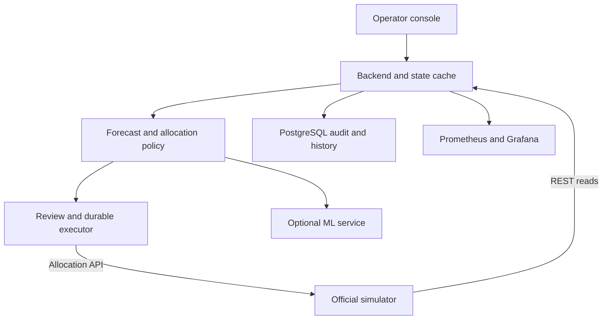
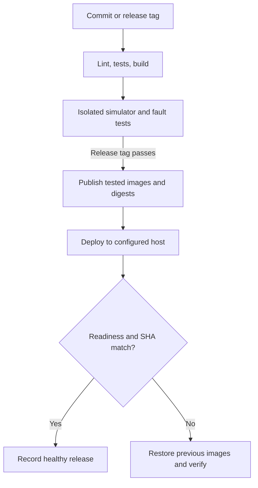

# plan.md — Jalani · Fuel Supply Intelligence & Resilience Platform

> BUP CSE Fest 2026 · Hackathon Finals · built on the organizers' **BUP Fuel Supply Simulator**
> Working name **Jalani** (জ্বালানি = fuel) — rename freely.
> This file is the single source of truth for the team **and** the AI coding agent. Change a decision here first, then in code.
> Revised 29 September 2026. This is a build specification, not evidence that the application is implemented or deployed.
> Latest API source: `docs/simulator-guide.pdf` (uploaded `Final-1.pdf`). See `docs/source-review.md` for the comparison and corrections.
> Companion files: `whatwillbedone.md` (what each step produces + theory) · `prompts.md` (copy-paste prompts).

---

## 0. TL;DR

A web **operator console + backend "brain"** on top of the simulator that runs the brief's loop:

| Loop step | What our system does |
|---|---|
| Observe | refreshes the network at a bounded cadence, including while paused (REST) and listens for change hints (SSE) |
| Detect | flags demand spikes, late/short supply, broken routes, outages, bottlenecks |
| Predict | forecasts demand → "Tongi DIESEL empty in 5.1 h, 78% risk" |
| Decide | picks depot + route + litres per station/fuel without ever breaking a limit |
| Simulate | re-runs the future with that shipment → "risk 78% → 12%", plus alternatives |
| Act | after operator approval (or confident autopilot) → `POST /v1/allocations` |
| Monitor | Prometheus + Grafana, JSON logs, System Health page |
| Recover | retries, circuit breaker, cached state, fallback model/policy, degraded mode |

Target after implementation: `docker compose up -d --build`. The attached CI/CD integration files require the backend and frontend from the prompts; the build pack itself is not the finished application.

---

## 1. How we get marks (read first)

| Criterion | Weight | What we will show |
|---|---|---|
| Working product & UX | 20% | Operator console: overview, alerts, recommendation cards with Approve, decision history, health |
| Intelligence & decision quality | 20% | Forecast + Monte Carlo stockout risk + constrained allocation + what-if + benchmark vs baseline policies |
| Architecture & integration | 15% | Clean services, REST = truth / SSE = hint, idempotent writes, nothing hardcoded, diagram |
| DevOps & engineering quality | 15% | docker compose, CI pipeline, tests, versioning, rollback, Makefile |
| Resilience & incident response | 10% | Degraded mode, circuit breaker, cache, layered fallbacks, human review, runbook, live chaos drill |
| Observability & performance | 10% | Prometheus metrics, Grafana dashboards + alert rules, JSON logs, health panel, k6 numbers |
| Demo & problem understanding | 10% | 14-step story (§13), assumptions doc, honest trade-offs |

**Scoring priority:** intelligence and decision quality carry 20%; DevOps, resilience, and observability together carry 35%. This is a prioritization aid, not a guarantee of ranking. Deployment, observability, a failure demonstration, and measured load testing are required. CI/CD is strongly encouraged in the brief and a priority for this team.

**Optional advanced work (brief §21) we get almost for free — name these to judges:** optimization + ML hybrid (ML forecast → constrained allocator), uncertainty-aware allocation (Monte Carlo risk), counterfactual simulation (what-if), automated incident detection, policy rollback, event-driven architecture (SSE hints), generative-AI operations assistant, drift detection (stretch). The brief also says "complexity itself will not guarantee a higher score" — so each one must visibly help the operator.

---

## 2. Design principles (non-negotiable)

1. **Simulator = world, we = brain.** Never modify the simulator image. Talk to it only over HTTP via `SIMULATOR_URL`.
2. **REST is truth, SSE is a hint.** After any SSE event (or poll), re-GET the state.
3. **Discover, don't hardcode.** Read regions/depots/stations/routes from the API on every refresh. Organizers may change the world mid-event.
4. **Every write is idempotent.** Persist one immutable request body and `idempotency_key` per shipment before sending it. Retry the same pair and reconcile uncertain outcomes; never generate a replacement key merely because a response was lost.
5. **Never decide on bad data.** Validate every response. Stale, invalid, inconsistent, or unavailable data → display cached state and block all allocation execution, including manual approval, until fresh validation succeeds. A human may review or queue a proposal meanwhile.
6. **Always have a fallback.** ML down → baseline forecaster → rule-based policy. LLM down → template text. Simulator down → last-known-good cache + degraded mode.
7. **Humans stay in control.** Consequential or low-confidence decisions need approval; everything is audited.
8. **Thin vertical slice first.** Simulator → backend → UI working end-to-end before intelligence and polish.
9. **Beginner-readable code.** Small functions, clear names, comments that explain *why*.
10. **Label simulated data.** UI shows "SIMULATED ENVIRONMENT — not real fuel infrastructure".

---

## 3. Architecture



| Service | Tech | Host port | Job |
|---|---|---|---|
| `simulator` | `asifmahmoud414/bup-fuel-supply-simulator:1.0.0` | 8000 | The world. Untouched. |
| `backend` | Python 3.11, FastAPI, httpx, Pydantic v2, SQLAlchemy 2 | 8080 | Integration, cache, intelligence, decisions, API, metrics |
| `ml-service` | FastAPI, scikit-learn, joblib | 8001 | Demand model (versioned). Separate so it can die without killing the app |
| `db` | PostgreSQL 16 | internal | History, snapshots, recommendations, alerts, audit |
| `frontend` | React + Vite + TS + Tailwind + TanStack Query + Recharts, nginx | 3000 | Operator console |
| `prometheus` | prom/prometheus | 9090 | Scrapes metrics, evaluates alert rules |
| `grafana` | grafana/grafana | 3001 | Dashboards provisioned from files |
| `k6` (profile `loadtest`) | grafana/k6 | – | Load tests on demand |
| stretch | Loki + Promtail, cAdvisor, OpenTelemetry/Jaeger | – | Only if time is left |

Inside Docker, services use names: `http://simulator:8000`, `http://ml-service:8001`, `db:5432`.
`SIMULATOR_URL` is configurable so judges can point us at their own simulator instance.

---

## 4. The simulated world — what matters for decisions

- 1 tick = 15 sim-minutes → **96 ticks = 1 sim day**.
- Default speed 8 ticks/s → **1 sim day ≈ 12 real seconds** (too fast to watch). Use `SIMULATION_SPEED=1` for dev and demo (1 day ≈ 96 s), or pause + `POST /admin/step` for exact tests.
- 2 regions, 2 depots, 4 stations, 6 routes, 3 fuels (DIESEL, PETROL, OCTANE). Tables in Appendix A.
- Initial cover estimates in Appendix A.9 are planning estimates, not measured stockout times. Hour factors, region-factor application, tick ordering, and demand noise must be checked with a no-action baseline before choosing the demo timing.
- Strong hour-of-day peaks (industrial ×1.55 in daytime) → forecasts must be hour-aware.
- Transit 2–4 ticks (30–60 min); max 5,000–7,000 L per allocation; depot dispatch cap 11–12k L per tick.
- Cross-region routes (`route-gazipur-karnaphuli`, `route-patiya-mirpur`, 4 ticks) are the backup when a home route breaks.
- **Supply is finite:** a fixed list of 22 ship arrivals (guide §8.7). After the last one lands, depots only drain — a long enough run ends in shortage whatever we do. Keep the demo inside that window (start from a fresh reset); once stock is short, the job becomes **rationing by priority** (§5.4 step 6).
- **Speed:** we use speed 1, but judges may run the default speed 8 against our app. Refresh every ≤ 1 s, decide on every refresh, size the demand-history fetch by the tick gap — measure tick lag and missed demand rows at speed 8; a one-second refresh alone does not prove sufficient performance. Expose freshness in both seconds and simulator ticks, and block execution if the configured tick-lag limit is exceeded.
- The score that matters: `service_level = served / (served + unmet)` from `GET /v1/metrics`.

**Phase 1 must verify (the guide is ambiguous) → write answers in `docs/assumptions.md`:**
- [ ] Does `DISPATCH_CAPACITY_EXCEEDED` count only allocations created this tick, or all PENDING + IN_TRANSIT from that depot?
- [ ] Is the region `demand_factor` applied on top of the profile?
- [ ] Does `/v1/demand-history` return the newest rows first? The guide says "filter to recent N", so probably yes. There is no offset parameter: if recent rows cannot be retrieved, record a data gap and use documented priors or another documented interface. Inventory deltas cannot recover unmet demand after a stockout; never label them as complete demand observations.
- [ ] Supply window: last `planned_tick` in `/v1/supply-arrivals`, and total fuel (depots + stations + supply) vs total demand per depot/fuel → how many sim days the network can last. Sets demo length and benchmark horizon. If supply < demand, rationing starts early.
- [ ] Idempotent replay returns 200 or 201? (Guide §5.4 says 201, §9 says 200 → accept both.)
- [ ] What happens if a shipment would overflow the station on arrival? Count both PENDING and IN_TRANSIT commitments.
- [ ] What is the order of arrivals, demand consumption, and departures within a tick? What departure/arrival tick is observed for a new shipment?
- [ ] Do actions and fault headers change while tick is unchanged? Poll them even while PAUSED. Record reset behavior and any generation identifier actually returned by the API.

---

## 5. Intelligence design (the brain)

Runs after every fresh snapshot (max once per second):
`snapshot → 5.1 forecast → 5.2 risk → 5.3 detect → 5.4 recommend → 5.5 what-if → 5.6 confidence → 5.7 explain → queue / autopilot`

### 5.1 Demand forecasting
**Baseline "profile" forecaster (v1, always available):**
- Learns average base demand per (station, fuel, hour-of-day) from our stored history, divided by the station's `demand_multiplier` at that tick.
- Forecast(tick) = profile[station, fuel, hour] × current `demand_multiplier` × `correction`.
- `correction` = EWMA (α 0.3) of actual/forecast over the last 8 ticks, clipped 0.5–2.0 → self-corrects for shifts we can't see.
- Cold start (first sim day): documented profiles in `backend/config/profiles.yaml` (Appendix A.6–A.7), labelled as priors, replaced once real data exists.
- Uncertainty = rolling std of residuals per (station, fuel); cold start uses the documented noise (0.08–0.12).

**ML forecaster (v2, in `ml-service`):** scikit-learn `HistGradientBoostingRegressor`. Features: station, fuel, hour, demand_multiplier, lag-1, lag-2, rolling mean of last 4 ticks. Trained on generated history (§9), time-based split, MAE/MAPE vs baseline.

**Champion/challenger + layered fallback:** backend tracks live MAE of both and uses the better one. `ml-service` down or > 800 ms → baseline forecaster. No usable forecast at all → rule-based `naive_reorder` policy (§9) with every recommendation marked "needs review".

### 5.2 Stockout projection & risk
- **Inventory position** = on-hand + all simulator PENDING/IN_TRANSIT shipments to that station/fuel (each with its arrival tick).
- **Projection:** step forward tick by tick for H = 48 ticks (12 h): `inv += arrivals − forecast`. First tick ≤ 0 → `hours_to_stockout`.
- **Model-estimated risk:** simulate 300 demand paths with an explicit seed, nonnegative demand, documented residual assumptions, and the same arrival timing. Count paths with unmet demand within H, and compute expected unmet litres. This is uncertainty in our forecast, not randomness added to the deterministic simulator. Calibrate against held-out runs; 300 paths and all thresholds are design choices. Zero stock with zero future demand need not imply a stockout.
- Levels: LOW < 20% · MEDIUM 20–50% · HIGH 50–80% · CRITICAL > 80% **or** stockout sooner than the fastest available route can deliver (→ "mitigate, can't fully prevent").

### 5.3 Detection
| Detector | Signal | Example alert |
|---|---|---|
| Demand anomaly | residual z-score of last 4 ticks > 3, or `demand_multiplier` changed | "Tongi DIESEL demand +78% vs normal (z=4.1)" |
| Abnormal inventory change | drop not explained by demand + our shipments (> 3σ) | "Unexplained inventory drop at Mirpur OCTANE" |
| Supply delay | arrival `DELAYED`, `planned_tick` moved, or tick passed without `ARRIVED` | "Gazipur DIESEL supply late by 8 ticks" |
| Supply shortfall | arrival quantity lower than first seen | "Patiya PETROL delivery cut 50%" |
| Route disruption | route `DISRUPTED`, allocation `FAILED` | "route-gazipur-mirpur down → rerouting" |
| Outage / constraint | station `OUTAGE`, depot `CONSTRAINED` | status alerts |
| Bottleneck | depot dispatch use > 80%, or depot cover < 12 h before next supply | "Gazipur is the bottleneck" |
| Regional disruption | ≥ 2 HIGH-risk station-fuels in one region | "Dhaka regional shortage risk" |

Anomalies are cross-checked with ACTIVE `GET /v1/events` and tagged "confirmed by event #n".
Alert lifecycle: OPEN → ACKNOWLEDGED → RESOLVED (auto-resolve after the signal is gone for 4 ticks).

### 5.4 Recommender (decision engine)
**v1 — priority-based greedy (`greedy_v1`, MVP):**
1. Candidates: every OPEN (station, fuel) with `hours_to_stockout < 12` or `risk ≥ 0.20`.
2. Sort by `priority_weight × risk`, then by `hours_to_stockout` (most urgent first — hospital triage).
3. Routes into that station: AVAILABLE, depot OPEN/CONSTRAINED with fuel. Prefer home-region depot, then shortest transit. Avoid routes that arrive after the stockout unless nothing else exists.
4. Quantity = fill to `TARGET_COVER_HOURS = 24` of forecast demand, then cap by **every** limit:
   - `route.max_shipment` (split into several allocations if needed)
   - depot inventory (a **cross-region** shipment may not push the source depot below its own region's next-12 h forecast need — stops Gazipur starving Dhaka to help Chattogram)
   - depot dispatch headroom this tick (count what this cycle already planned + existing PENDING/IN_TRANSIT per the Phase 1 finding)
   - station headroom = capacity − on-hand − PENDING − IN_TRANSIT − other reservations in this plan (prevents `DESTINATION_CAPACITY_EXCEEDED` and overflow)
   - depot `CONSTRAINED` → use at most 50% of its dispatch capacity (assumption, configurable)
5. Drop anything under 500 L (not worth a truck).
6. **Rationing when supply is short:** if total need > available depot stock, first lower the target to 12 h for everyone (more stations get something), then fill by priority. Default weights in `backend/config/policy.yaml`: DIESEL 1.3 · PETROL 1.0 · OCTANE 0.8 (diesel moves trucks, irrigation, generators). Documented assumption, editable in UI.

**v2 — LP optimizer (`lp_v2`, stretch):** PuLP + CBC. Variables = litres per (route, fuel). Minimise Σ weight × risk × shortfall + λ × (litres × transit_ticks). Same limits as constraints. Compare with v1 in the benchmark (§9); switch at runtime = **policy rollback**.

**RL: not used.** For judges: the world is small, deterministic and fully observable, so a transparent heuristic/LP is easier to verify and explain; RL needs thousands of episodes and is hard to justify (brief §8 asks for exactly this comparison). The benchmark tests whether our policy improves on simple baselines; report losses as well as wins.

### 5.5 What-if (the "Simulate" step)
For each recommendation, re-run the Monte Carlo with and without it (same random seed for both = fair) → `risk_before → risk_after`, `unmet_before → unmet_after`. Also 2–3 **alternatives**: half quantity, best other depot/route, do nothing. This produces the brief's card ("Stockout risk reduced 72% → 19%").

### 5.6 Confidence
Freshness, schema validity, database availability, and successful reconciliation are hard execution gates; a numeric confidence score cannot override them. This heuristic score is not a calibrated probability.

Example score (clip final value to 0–1): start 1.0 · × (1 − recent MAPE, floor 0.5) · −0.3 stale data · −0.2 active anomaly/event on that station or region · −0.2 fallback forecaster in use · −0.1 cross-region route.
HIGH ≥ 0.75 · MEDIUM 0.5–0.75 · LOW < 0.5 → **LOW always needs human review.**

### 5.7 Explanation
Each recommendation stores structured facts: `signals` (why at risk), `constraints` (what limited the quantity), `impact`, `confidence`, `alternatives`, `policy_version`, `model_version`.
Default text = template built from those facts (always works). Optional LLM rewrite (§5.9).

### 5.8 Human-in-the-loop & autopilot
- **Advisory (default):** everything waits in the approval queue → Approve / Modify quantity / Reject.
- **Autopilot:** executes only if confidence HIGH, data fresh, mode NORMAL, database healthy, no unresolved write outcomes, no active incident on that station, quantity within limits. Manual execution follows the same freshness/storage gates. Consequential moves always go to a human (brief §24: "preserve human review for consequential simulated decisions"): cross-region shipments, anything touching an ACTIVE crisis event, rationing decisions. Anything that fails a gate → queue.
- Every action is audited: who (operator name or `AUTOPILOT`), when, why.

### 5.9 Generative AI (supports ops — not a chatbot)
- **Incident brief** on crisis detection: what happened, impact (stations, fuels, hours), what the system recommends (3–4 sentences).
- **Shift summary** button for the current network state.
- **Plain-language explanation** of a recommendation.
- Grounded only on our JSON facts, 8 s timeout, cached per state hash, labelled "AI-generated · simulated data", **never executes actions**.
- Any OpenAI-compatible API via `.env` (`LLM_BASE_URL`, `LLM_API_KEY`, `LLM_MODEL` — Groq / Gemini / OpenAI / local Ollama). No key or failure → template text.
- Stretch: "Investigate" box that answers operator questions from current state + decision history.

---

## 6. Backend design

### 6.1 Modules (`backend/app/`)
| Module | Responsibility |
|---|---|
| `config.py` | settings from env (pydantic-settings) |
| `sim/client.py` | shared async httpx client: timeouts (connect 2 s, read 5 s), retry with exponential backoff + jitter (3 tries, only GETs and idempotent allocation POSTs), circuit breaker, parses all error shapes, reads `X-Simulator-Stale`, metrics per call |
| `sim/schemas.py` | Pydantic models for every simulator response (`extra="ignore"`: new fields don't break us; missing required fields do) |
| `sim/stream.py` | SSE listener: only marks state dirty (no heavy work), watchdog reconnect after 20 s silence, polling fallback |
| `core/state.py` | latest snapshot, last-known-good, data age, stale flag, durable `run_id` and reset suspicion (backward tick, reset notice, own reset action, scenario/seed changes; ambiguous reset blocks writes pending reconciliation) |
| `core/mode.py` | system mode NORMAL → DEGRADED → RECOVERING → NORMAL |
| `core/breaker.py` | tiny circuit breaker: 5 failures → OPEN 10 s → HALF_OPEN probe (`GET /v1/instance`, never `/v1/health`) → CLOSED |
| `intelligence/` | `forecast.py`, `risk.py`, `detection.py`, `recommender.py`, `whatif.py`, `confidence.py`, `explain.py`, `llm.py` |
| `decisions/` | `executor.py` (submit + error mapping + tracking), `autopilot.py` (mode + gates) |
| `db/` | SQLAlchemy models + session |
| `api/` | routers (§6.5) |
| `auth.py` | JWT login; roles viewer / operator / admin (users from env) |
| `metrics.py` | Prometheus metrics (§8.1) |
| `benchmark.py` | offline policy comparison CLI (§9) |

### 6.2 Background loop
1. SSE event or a 1 s poll → refresh, even when the tick did not change (allocations, faults, and admin actions may change while PAUSED). Coalesce refreshes and serialize execution.
2. Bracket resource reads with instance reads. Record snapshot start/end ticks and age; bounded retries or a conservative consistency flag handle a moving world. REST reads are not an atomic multi-resource snapshot. Do not pause the live simulator to obtain consistency.
3. Refresh = parallel GETs: instance, regions, depots, stations, routes, supply-arrivals, events, allocations, metrics, demand-history (limit = 12 × ticks since last fetch + 24, max 2000; upsert by (run_id, id)).
4. Validate → update state → persist snapshot every 4 ticks.
5. Intelligence pipeline (§5) → upsert alerts and recommendations (unexecuted ones older than 4 ticks → EXPIRED).
6. Autopilot executes eligible recommendations only after a final fresh-state and database check.
7. Update metrics.

### 6.3 Executor: simulator response → action
| Response | Action |
|---|---|
| 201 / 200 | save simulator allocation id (replay is fine) |
| `ROUTE_DISRUPTED`, `STATION_CLOSED`, `DEPOT_CLOSED` | mark FAILED, re-plan next cycle (alternative route) |
| `INSUFFICIENT_INVENTORY`, `DESTINATION_CAPACITY_EXCEEDED` | refresh state, re-plan with a smaller quantity |
| `DISPATCH_CAPACITY_EXCEEDED` | refresh next tick and revalidate; do not blindly resend an outdated plan |
| `ROUTE_CAPACITY_EXCEEDED` | split into ≤ `max_shipment` parts |
| `IDEMPOTENCY_KEY_MISMATCH` | bug alarm: log + system alert, never reuse that key |
| `NOT_FOUND`, `ROUTE_MISMATCH` | world changed: force full refresh + alert |
| 503 / timeout / lost response | persist UNKNOWN; reconcile `/v1/allocations` by the original key, then retry the identical body if appropriate; block conflicting orders until resolved |
| 422 | bug: log + alert, never retry |

Idempotency key = `jal-{run_id}-{recommendation_id}-{part}` (at most 150 characters). Commit the immutable body, key, actor, and status BEFORE the first POST. Lock/claim approval transactionally so concurrent clicks or workers share that record. After a crash, recover unresolved writes and reconcile before sending new work. If the database cannot commit, do not execute. A definitive rejection may produce a newly approved plan with a new key; an unknown outcome may not.

### 6.4 Database tables
`demand_obs` (unique on run_id + sim id, station, fuel, tick, demand, served, unmet, multiplier) · `snapshots` (tick, json) · `recommendations` (all card fields + status + mode + operator) · `executions` (run_id, rec id ↔ sim allocation id, unique key, immutable request JSON, status incl. UNKNOWN, failure_reason) · `alerts` (type, severity, entity, fuel, message, status, first/last tick) · `incidents` (brief text, source) · `audit_log` (who, action, target, details, time) · `settings` (autopilot mode, policy version).

### 6.5 API contract v1 (frontend builds against this — mock it first)
| Method & path | Role | Purpose |
|---|---|---|
| POST `/api/auth/login` | – | JWT + role |
| GET `/api/health`, `/api/health/live`, `/api/health/ready` | – | components (§8.4); `live` = process liveness, `ready` = critical initialization/DB/fresh-state checks, overall health includes degraded dependency details |
| GET `/api/network/state` | viewer | stations/depots/routes + computed risk + KPIs |
| GET `/api/stations/{id}/forecast?fuel=` | viewer | history + forecast + band |
| GET `/api/alerts?status=` · POST `/api/alerts/{id}/ack` | viewer · operator | shortage, detection, system alerts |
| GET `/api/recommendations?status=` | viewer | recommendation cards |
| POST `/api/recommendations/{id}/approve` `{quantity?}` · `/reject` `{reason}` | operator | human decision |
| POST `/api/allocations/{sim_id}/cancel` | operator | cancel a PENDING shipment |
| POST `/api/decide?dry_run=true` | operator | compute recommendations now, no side effects (load test) |
| GET `/api/decisions` | viewer | decision history + outcomes |
| GET `/api/supply` · GET `/api/events` | viewer | incoming supply, disruptions |
| GET/POST `/api/settings/autopilot` · `/api/settings/policy` | operator · admin | mode, policy version |
| GET `/api/summary` · GET `/api/incidents` | viewer | AI/template summaries |
| POST `/api/control/sim/{action}` (run, pause, step, reset) · `/api/control/events` · `/api/control/faults` · `/api/control/faults/clear` | admin | demo Control Room (proxies `/admin/*`) |
| POST `/api/control/chaos/{kind}` (crash, corrupt-next) | admin + `CHAOS_ENABLED=true` | demo-only failure injection |
| GET `/metrics` | – | Prometheus |

`GET /api/network/state` (trimmed):
```json
{
  "run_id": "run-3", "tick": 212, "sim_time": "2026-01-03T05:00:00+00:00",
  "sim_status": "RUNNING", "mode": "NORMAL", "stale": false, "data_age_s": 1.2,
  "kpis": {"service_level": 0.981, "unmet_liters": 234.5, "in_transit_liters": 12500,
           "open_alerts": 3, "pending_recommendations": 2},
  "regions": [{"id": "region-dhaka", "name": "Dhaka Division", "demand_factor": 1.0,
               "fuels": {"DIESEL": {"demand_last_hour": 1180, "normal_last_hour": 820, "forecast_12h": 16400}}}],
  "stations": [{
    "id": "station-mirpur", "name": "Mirpur Fuel Station", "region_id": "region-dhaka",
    "status": "OPEN", "demand_multiplier": 1.0,
    "fuels": {"DIESEL": {"inventory": 8400, "capacity": 15000, "in_transit": 0,
                         "forecast_12h": 11900, "hours_to_stockout": 6.2,
                         "risk": 0.72, "risk_level": "HIGH"}}
  }],
  "depots": [{"id": "depot-gazipur", "status": "OPEN", "dispatch_capacity_per_tick": 12000,
              "dispatch_used": 7000,
              "fuels": {"DIESEL": {"inventory": 41000, "capacity": 90000, "next_supply_tick": 236}}}],
  "routes": [{"id": "route-gazipur-mirpur", "source_depot_id": "depot-gazipur",
              "destination_station_id": "station-mirpur", "transit_ticks": 2,
              "max_shipment": 7000, "status": "AVAILABLE"}]
}
```

Recommendation card (mirrors the brief's §9 example):
```json
{
  "id": 57, "status": "PROPOSED", "created_tick": 212,
  "station_id": "station-mirpur", "fuel_type": "DIESEL",
  "projected_stockout_hours": 6.2, "current_inventory": 8400, "expected_demand_12h": 11900,
  "action": {"source_depot_id": "depot-gazipur", "route_id": "route-gazipur-mirpur",
             "quantity": 5000, "eta_tick": 215},
  "impact": {"risk_before": 0.72, "risk_after": 0.19, "unmet_before_l": 3500, "unmet_after_l": 300},
  "confidence": {"score": 0.81, "level": "HIGH"}, "requires_review": false,
  "signals": ["Demand 42% above normal for this hour (z=3.1)", "Cover 6.2 h < target 24 h"],
  "constraints": ["Station headroom 6,600 L (capacity 15,000)",
                  "Gazipur dispatch headroom this tick 5,000 L (7,000 already planned)"],
  "alternatives": [
    {"label": "2,500 L, same route", "risk_after": 0.45},
    {"label": "5,000 L from Patiya via route-patiya-mirpur (4 ticks)", "risk_after": 0.27},
    {"label": "Do nothing", "risk_after": 0.72}],
  "explanation": "Mirpur DIESEL runs out in ~6.2 h (risk 72%). Sending 5,000 L from Gazipur (arrives in ~45 min) cuts risk to 19%. Limited by Gazipur's dispatch capacity this tick.",
  "explanation_source": "template", "policy_version": "greedy_v1", "model_version": "profile_v1"
}
```

---

## 7. Frontend — operator console

Top bar: sim clock (tick, sim time, RUNNING/PAUSED) · mode chip (NORMAL / DEGRADED / RECOVERING) · autopilot switch · user + role · "SIMULATED" badge. Degraded or stale → full-width banner with data age.

| Page | Shows |
|---|---|
| Overview | KPI cards (service level, unmet L, in-transit L, open alerts, pending recs), SVG network schematic (depots → stations, routes coloured by status, cross-region dashed, stations coloured by worst risk), regional demand panel (last hour vs normal, per fuel — brief §6 lists it), top-5 risks, incident feed |
| Stations & Depots | inventory bars per fuel vs capacity, hours to stockout, risk badge, status, demand multiplier; depot stock + dispatch used |
| Recommendations | cards in the brief's format; confidence pill; "Needs review"; expandable "Why?" (signals, constraints, alternatives, explanation + source); Approve / Modify / Reject |
| Alerts | shortage, detection and system alerts; filter; acknowledge |
| Supply & Disruptions | supply timeline (SCHEDULED / DELAYED / ARRIVED) with ETA and delay vs first-seen plan, supply-window countdown (ticks until the last scheduled ship), active events, route status |
| Forecasts | per station/fuel: history + forecast + uncertainty band, model badge, live MAE, model rollback (admin) |
| Decision History | who/AUTOPILOT, qty, route, simulator status chain, failure reason, outcome; CSV export; benchmark results |
| System Health | component table like brief §15, p95 latency, error rate, fallbacks, version, links to Grafana/Prometheus |
| Control Room (admin) | run/pause/step/reset, inject events & faults (forms + demo presets), chaos buttons, policy switch — keeps working during faults because `/admin/*` bypasses them |

Data fetching: TanStack Query polling every 2 s; on failure keep showing the last data with an "Offline since HH:MM:SS" chip. Offline-safe: no map tiles or CDNs at demo time.

---

## 8. Observability

### 8.1 Metrics (Prometheus names)
| Layer | Metrics |
|---|---|
| Application | `http_requests_total`, `http_request_duration_seconds` (prometheus-fastapi-instrumentator), `sim_requests_total{endpoint,status}`, `sim_request_duration_seconds`, `sim_up`, `sim_circuit_state`, `sim_stream_connected`, `state_age_seconds`, `state_stale`, `system_mode` |
| System | `process_cpu_seconds_total`, `process_resident_memory_bytes` (default collectors); stretch: cAdvisor per container |
| Intelligence | `forecast_mae{model}`, `recommendation_confidence` (histogram), `shortage_alerts_total{severity}`, `recommendations_total{status}`, `decisions_executed_total{mode}`, `fallback_active{component}`, `fallback_activations_total{component}`, `human_review_requests_total`, `decision_cycle_seconds` |
| Domain | `station_inventory_liters{station,fuel}`, `station_hours_to_stockout{station,fuel}`, `station_stockout_risk{station,fuel}`, `depot_inventory_liters{depot,fuel}`, `sim_service_level`, `sim_unmet_liters`, `sim_allocation_failures` |

`sim_up` = 1 only while real `/v1/*` refreshes succeed — not `/v1/health`, which bypasses injected faults — so `SimulatorDown` actually fires during an injected outage.

### 8.2 Grafana dashboards (provisioned from `observability/grafana/`)
1. **Service health** — request rate, error rate, p50/p95/p99, simulator calls/errors, circuit state, CPU/memory.
2. **Intelligence** — forecast MAE per model, confidence distribution, alerts/hour, decisions auto vs manual, fallback activations.
3. **Fuel network** — inventory per station/fuel, risk, service level, unmet demand.

### 8.3 Alert rules (`observability/prometheus/rules.yml`)
`SimulatorDown` (sim_up == 0 for 30 s) · `HighLatencyP95` (> 500 ms for 1 m) · `FallbackActive` · `ServiceLevelLow` (< 0.95) · `StaleData` (state_age_seconds > 60).

### 8.4 Logs & health
- JSON logs (python-json-logger), one line per event: `decision.proposed / approved / rejected / executed / failed`, `integration.error`, `fallback.activated`, `mode.changed`, `recovery.completed`, `sim.reset_detected`. Always include `tick`, `run_id`, recommendation id.
- `GET /api/health` example:
```json
{
  "status": "degraded", "mode": "DEGRADED", "version": "1.2.0", "git_sha": "a1b2c3d",
  "components": {
    "backend": {"status": "healthy"},
    "database": {"status": "healthy", "latency_ms": 3},
    "simulator": {"status": "unhealthy", "circuit": "open", "last_ok_tick": 212, "data_age_s": 35},
    "prediction_service": {"status": "fallback", "model": "profile_v1"},
    "decision_engine": {"status": "healthy", "policy": "greedy_v1", "last_cycle_ms": 41},
    "event_stream": {"status": "polling"},
    "llm": {"status": "disabled"}
  },
  "p95_latency_ms": 164, "error_rate": 0.004
}
```

---

## 9. Data, ML training & proof of decision quality

- **Primary data:** the simulator. **Generated data:** we run the deterministic simulator to create training history → `data/demand_history.csv`, documented in `docs/data.md`.
- `scripts/generate_history.py`: reset → pause → optionally inject demand spikes → `/admin/step` N ticks → pull `/v1/demand-history?station_id=…&limit=2000` per station every ~500 ticks → dedupe by id → CSV (+ multiplier per tick). ⚠️ resets the simulator.
- `ml-service/train.py`: time-based split (last 20% = test), baseline vs model MAE/MAPE per fuel, saves `models/demand_vN.joblib` + `demand_vN.json`, updates `models/registry.json` (`active`, `previous`), appends to `ml-service/experiments.csv` (= experiment tracking), writes `docs/model-report.md`.
- **Benchmark (`python -m app.benchmark`) — our strongest evidence:**
  - scenarios in `scenarios/*.yaml`: `calm`, `demand_spike`, `route_disruption_delay`, `combined_crisis` (= scenario configuration)
  - policies: `do_nothing`, `naive_reorder` (station fuel < 40% capacity → send max from home depot), `greedy_v1`, (`lp_v2`)
  - each run: pause → reset → pause → inject scenario events → a documented common horizon (e.g. 288 ticks / 3 sim days): decide → submit → `/admin/step` → read `/v1/metrics`
  - output `docs/benchmark-results.md`: service level, unmet L, failures, litres moved, chart. Same seed + same events = fair comparison (= simulation replay).
  - ⚠️ resets the simulator — use a separate benchmark instance; disable all live ingestion/execution against that instance while benchmarking.

---

## 10. Resilience matrix (brief §11)

| Failure | Detected by | System response | Operator sees | Demo with |
|---|---|---|---|---|
| Simulator unavailable | errors → breaker opens | serve last-known-good, pause autopilot, probe every 10 s, resync on recovery | red banner "Simulator unreachable — data from tick 212 (35 s old)" | fault `unavailable` 60 s |
| Error rate 25% | failed calls | retries absorb; breaker if persistent | small warning; Grafana shows retries | fault `error_rate` |
| Latency | duration metrics | timeouts, coalesced refresh | p95 rises in Grafana | fault `latency` 800 ms |
| Stale data | `X-Simulator-Stale` header | keep but flag, block all execution; proposals may be reviewed but not sent | yellow banner | fault `stale_data` |
| Stream disconnect | SSE 503 / silence > 20 s | poll every 1 s, reconnect with backoff, full resync | chip "Live stream lost — polling" | fault `stream_disconnect` |
| Invalid response | Pydantic + sanity checks (negative stock, unknown ids) | reject, keep previous snapshot, system alert | alert "Invalid simulator data" | unit test + chaos `corrupt-next` |
| ML service down/slow | timeout 800 ms / connection error | baseline forecaster → rule-based policy if needed | badge "Fallback forecaster" | `docker compose stop ml-service` |
| Low confidence | score < 0.5 | human review required | "Needs review" tag | during a demand spike |
| Database down | query errors | cached reads only; block approvals and autopilot because durable audit/idempotency is unavailable; reconcile on recovery | health: DB red, execution blocked | `docker compose stop db` |
| LLM down / no key | timeout / error | template text | "Template" label | blank the key |
| Allocation rejected (409) | error code | §6.3 table | failure reason in history | disrupt a route mid-flight |
| Backend crash | main process exits | `restart: unless-stopped` handles exit; rebuild from DB + simulator, reconcile uncertain writes | "Reconnecting…" then back | chaos `crash` |
| Simulator reset | backward tick / notice / own reset / identity change | reconcile, persist new `run_id`, scope old records, alert; ambiguous external reset blocks execution | notice "Simulation reset" | `/admin/reset` |

Each row gets a section in `docs/runbook.md` (symptom, detection, automatic response, operator action, how to verify recovery).

---

## 11. CI/CD, deployment, and recovery — start on day one

The concrete starter is in `.github/workflows/ci.yml`, `compose.ci.yml`, `deploy/compose.yml`, `scripts/`, and `docker/`. Read `CI_CD_GUIDE.md` for setup and `docs/ci-contract.md` for the required application interface. They are integration templates; application source, lockfiles, a repository, and a host still have to be supplied.

### 11.1 What the pipeline actually does
1. **Pull request / main push:** check required files → backend lint/tests → frontend lint/typecheck/tests/build → build two images once → boot an isolated stack with the official simulator → contract, application, and fault/recovery checks → retain test reports and logs.
2. **Release tag `vX.Y.Z`:** run the same gates on that tagged commit, confirm it belongs to main, publish the tested image bytes to GHCR, resolve immutable digests, and write a release manifest containing both images and the git SHA. No image is rebuilt for publication.
3. **Deploy job:** when a host is configured and `ENABLE_DEPLOYMENT=true`, transfer the release bundle over SSH, pull both images by digest, update application services only, check readiness and a real authenticated read through the frontend, and verify the running SHA. This is the missing deployment stage in the earlier plan.
4. **Failure:** roll back both application images to the previous manifest, recheck health, retain diagnostics, and leave the workflow failed so the failed release is visible. No database volume is deleted, and the live simulator is never reset by deployment.



### 11.2 Health is three different questions
| Check | Meaning | Response to dependency faults |
|---|---|---|
| `/api/health/live` | Backend process/event loop is responsive | Remains 200 during a simulator fault |
| `/api/health/ready` | Initialized, DB available, validated sufficiently fresh snapshot, execution state reconciled | Returns 503 when critical readiness is absent |
| `/api/health` + real `/v1/*` reads | Component health, mode, freshness, fallback, version | Reports degradation even if process is alive |

`/v1/health` bypasses injected faults. It cannot prove simulator data reads work. Test `/v1/instance` and the real application read path too. Docker health checks mark health; restart policies handle process exits, not health-status changes alone. Do not kill/restart the backend every time an upstream dependency fails: cached reads and recovery must keep working.

### 11.3 Deployment rules
- Use separate CI and demo resources. CI may reset its own disposable simulator. Live deploy/rollback uses only read-only checks and never runs `down -v` or `/admin/reset`.
- Deploy images by digest, keep current/previous release manifests, and expose `APP_VERSION` and `GIT_SHA` in health and UI. Roll back backend and frontend together.
- Keep `.env` only on the host; Actions secrets contain SSH credentials and application smoke-test credentials. PR jobs do not receive deployment secrets.
- Preserve database volumes and take a pre-deploy `pg_dump`. Use backward-compatible schema changes. An image rollback does not undo a database migration; destructive migrations need a separately rehearsed restore plan.
- This Compose design may have a short interruption during replacement. It is not blue/green and must not be presented as zero downtime.
- Host setup is explicit: Docker Engine + Compose plugin, a reachable Linux host, SSH key and verified known-host entry, GHCR pull permission, disk capacity, and a configured `.env`. A laptop demo needs no paid cloud server; a hosted runner cannot reach an ordinary localhost laptop.
- Bind simulator/admin, Postgres, Prometheus, and Grafana to internal networks or loopback. For a public operator UI, configure TLS and real passwords before exposing it.
- Healthcheck commands must exist in each image. The starter probes the official simulator externally rather than guessing its installed tools.
- Start with a single backend executor. More replicas require a database lease/leader mechanism, not simply multiple polling loops.

### 11.4 CI/CD evidence to retain
PR failure screenshot; repaired green run; unit-test report; real simulator contract report; fault/recovery report; release manifest with two digests; deployed version/SHA; rollback report; post-rollback data continuity check. An unrun workflow is a configuration artifact, not proof of working CI/CD.

### 11.5 Build order
After Prompt 1 do **13A** (early CI). After the application has its first complete slice do **13B** (real integration gates and release). Once a host is available do **13C** (deployment/rollback). Finish with **13D** (evidence and rehearsal). Never wait until the final hours to discover Docker or GitHub Actions problems.

---

## 12. Load testing (k6)

| Workload | Target | Shape |
|---|---|---|
| Dashboard read | `GET /api/network/state` | ramp 0 → 20 → 50 → 100 VUs over ~3 min |
| Decision path | `POST /api/decide?dry_run=true` | 5 → 10 → 20 VUs |
| Prediction path | `POST ml-service /predict` | 10 → 50 VUs |

The brief requires at least one meaningful application path. Start with dashboard reads; add decision dry-run, and add prediction only if the optional ML service exists. Targets such as p95 < 500 ms and error rate < 1% are our goals, not organizer-mandated thresholds.

Report per implemented workload in `docs/load-test-results.md`: avg, p50, p95, p99, throughput (req/s), error rate, max concurrency, CPU/memory (`docker stats` + Grafana screenshot), where it breaks and why, one fix with before/after numbers.
We load-test **our** backend, not the simulator — our cache shields it (say this in the demo).

---

## 13. Demo script (brief §22) — ~8 min at `SIMULATION_SPEED=1`, pause while talking

**Setup:** use a dedicated demo instance, clear faults, reset and pause. Use deterministic steps and pre-rehearsed event timings. Begin in Advisory; use only measured recommendations and effects. The 8-minute length is a suggested rehearsal budget, not a duration stated by the brief. Show a release/rollback segment within that budget or in the Q&A. All numeric story examples below are illustrative until captured from a run.

| # | Story step | What happens on screen |
|---|---|---|
| 1 | Normal operations | Sim RUNNING, overview green, service level ~100% |
| 2 | Operator dashboard | 30 s tour: overview, stations, supply, health |
| 3 | Demand starts increasing | Control Room → preset "Demand spike Dhaka ×1.8" |
| 4 | System detects risk | Alert "Tongi DIESEL demand +80% (z=4.1), confirmed by event #1" |
| 5 | Shortage predicted | Tongi DIESEL "empty in ~5 h, risk 78%" |
| 6 | Recommendation generated | 6,500 L Gazipur → Tongi, ETA 2 ticks, risk 78% → 12% |
| 7 | Operator inspects | "Why?": signals, constraints, confidence, alternatives, AI explanation |
| 8 | Allocation simulated | Approve → PENDING → IN_TRANSIT → ARRIVED, inventory jumps, history row |
| 9 | Crisis event | Preset: route_disruption gazipur→mirpur + shipment_delay at Gazipur |
| 10 | System adapts | Reroute via Patiya → Mirpur, reserve logic, incident brief appears |
| 11 | Failure injected | `docker compose stop ml-service` + simulator fault `unavailable` 60 s |
| 12 | Monitoring detects | Health page red, Grafana alert firing, system alerts in UI |
| 13 | Fallback / recovery | Fallback forecaster badge, cached data with age, autopilot paused → fault expires → auto-resync; restart ml-service |
| 14 | Operations continue | Service level holding; benchmark table + load-test numbers |

Backup: screenshots + a screen recording of a full run. Everything runs offline except the optional LLM (falls back to templates).

---

## 14. Phases, team & timeline

Phase N corresponds to Prompt N and Step N. **CI/CD is the exception to numeric order:** 13A starts immediately after 1; 13B/13C/13D are milestone gates, not work postponed to the end.

| # | Phase | Owner | Tier | Est. |
|---|---|---|---|---|
| 0 | Kickoff: agent reads plan, creates its rulebook | all | MVP | 1 h |
| 1 | Repo skeleton + simulator in compose + exploration script | A | MVP | 1–2 h |
| 2 | Backend foundation (client, ingestion, state, DB, health, network state) | A | MVP | 3–4 h |
| 3 | Frontend MVP (layout, overview, stations & depots) | C | MVP | 3–4 h |
| 4 | Intelligence v1a: forecast, risk, detection, alerts | B | MVP | 3–4 h |
| 5 | Intelligence v1b: recommender, what-if, confidence, explanations | B | MVP | 3–4 h |
| 6 | Decision workflow: approve/reject, executor, history, autopilot, login | A + C | MVP | 3–5 h |
| 7 | Live stream + resilience + Control Room + runbook | A | MVP → Strong | 3–4 h |
| 8 | Observability: metrics, Prometheus, Grafana, alerts, health page | D | MVP | 2–3 h |
| 9 | ML service: data generation, training, versioning, fallback | B | Strong | 3–4 h |
| 10 | Benchmark vs baselines (+ LP optimizer stretch) | B | Strong | 2–4 h |
| 11 | GenAI incident briefs, summaries, explanations | A or C | Strong | 2 h |
| 12 | Load testing + results | D | MVP | 2 h |
| 13A–D | CI early, integration/release, deployment/rollback, evidence | D | Team priority | throughout build |
| 14 | Docs, architecture diagram, demo script, rehearsals | all | MVP | 3–4 h |

**MVP path:** 0 → 1 → 13A; then 2/3 → 4/5 → 6/7/8 → 13B → 12 → 13C/13D → 14. Run a small benchmark from 10 before feature freeze; add 9, expanded 10, and 11 only when the core works. These are estimates, not a confirmed event duration.

**Roles (4 people; with 3, A also takes D):** A = backend & integration · B = intelligence · C = frontend · D = DevOps, observability, docs.

**Parallel plan:**
- Block 1: everyone does Phase 0 together. A: 1 → 2. C: 3 against mocks (§6.5). B: study `data/world_snapshot.json`, prototype forecasting. D: 13A + Prometheus/Grafana skeleton.
- Block 2: A: 6 (backend) + 7. B: 4 → 5. C: 6 (UI) + alerts/forecast pages. D: 8 + 13B.
- Block 3: A: 11. B: 9 → 10. C: health page, Control Room, polish. D: 12 + 13C/13D + docs.
- Block 4: everyone: 14, bug fixes, 3 rehearsals with chaos drills. **Feature freeze 3–4 h before judging.**

**If short on time, cut in this order:** OpenTelemetry/Loki/cAdvisor → LP optimizer → Investigate box → drift detection → GenAI → ML service (keep the baseline forecaster and say "ML-ready"). **Never cut:** resilience, health page, load test, docs, rehearsal — they are required deliverables.

⚠️ Check whether the finals allow code written before the event. If not, use prep time for Phase 0, learning the tools, and a practice run of the prompts in a throwaway repo.

---

## 15. Deliverables checklist (brief §19–20)

Required:
- [ ] 1 Working application
- [ ] 2 Source repository (code, setup, dependencies, deployment instructions)
- [ ] 3 Simulator integration (official image)
- [ ] 4 Intelligence component
- [ ] 5 Operator interface
- [ ] 6 Architecture diagram (simulator → data/backend → intelligence → decision → application → monitoring)
- [ ] 7 Reproducible deployment
- [ ] 8 Observability evidence (logs, metrics, dashboards, alerts)
- [ ] 9 Resilience demonstration (≥ 1 meaningful failure)
- [ ] 10 Load-test evidence (workload + measured results)
- [ ] 11 Final demo

Recommended: [ ] CI/CD · [ ] automated tests · [ ] experiment tracking · [ ] model versioning · [ ] decision audit history · [ ] deployment versioning · [ ] simulation replay · [ ] scenario configuration · [ ] automated fallback · [ ] rollback

---

## 16. Assumptions (copy into `docs/assumptions.md`, extend with Phase 1 findings)

- Depot `CONSTRAINED` still ships (per guide); the guide does not specify a numeric reduction. As a conservative policy choice we self-limit to 50% of its dispatch capacity.
- Fuel priority weights DIESEL 1.3 / PETROL 1.0 / OCTANE 0.8 are a policy choice, editable.
- Transport cost proxy = litres × transit ticks.
- Demand noise ≈ normal; Monte Carlo uses learned residual std.
- Profile priors come from the organizer guide (not the API) and are replaced by learned values after one sim day.
- All results are simulated; nothing touches real fuel infrastructure, purchases or credentials (brief §24).

---

## 17. Surprise events playbook (brief: "the environment may change")

- **Domain events** (spike, disruption, delay, outage): detectors fire on their own. Narrate: detect → evaluate (risk numbers) → respond (recs, reroute) → explain ("Why?" + incident brief) → monitor recovery (alerts resolve, service level).
- **Engineering events** (kill a service, bad data, latency): follow `docs/runbook.md`; show health page + Grafana.
- **World/API changes** (new station, new field, new image version): nothing is hardcoded → restart backend, check `/api/network/state`, then use helper prompt H4.

---

## 18. Repository structure

```
jalani/
├── plan.md · whatwillbedone.md · prompts.md · CLAUDE.md · README.md
├── docker-compose.yml · .env.example · Makefile · .gitignore · .gitattributes
├── docs/        challenge-brief.pdf, simulator-guide.pdf, architecture.md, runbook.md, assumptions.md,
│                data.md, model-report.md, benchmark-results.md, load-test-results.md, deployment.md,
│                demo-script.md, judge-faq.md
├── backend/     Dockerfile, requirements.txt, app/{sim,core,intelligence,decisions,db,api}, config/{policy,profiles}.yaml, tests/
├── ml-service/  Dockerfile, app/, train.py, models/, experiments.csv, tests/
├── frontend/    Dockerfile, nginx.conf, src/{pages,components,api}
├── observability/ prometheus/{prometheus.yml,rules.yml}, grafana/{provisioning,dashboards}
├── loadtest/    dashboard.js, decide.js, predict.js, results/
├── scenarios/   calm.yaml, demand_spike.yaml, route_disruption_delay.yaml, combined_crisis.yaml
├── scripts/     explore.py, generate_history.py, loadtest_report.py
├── data/        generated CSV/JSON (documented in docs/data.md)
└── .github/workflows/ci.yml
```

---

## Appendix A — Simulator cheat sheet (from the Integration Guide)

### A.1 Run & URLs
- Image `asifmahmoud414/bup-fuel-supply-simulator:1.0.0`, port 8000.
- Env: `SIMULATION_SPEED` (ticks per real second, default 8) · `TICK_MINUTES` (default 15) · `SIMULATOR_START_MODE` (`paused` default, or `running`).
- Swagger `/docs` · ReDoc `/redoc` · admin console `/admin` (auto-refresh 2 s).

### A.2 Read endpoints (JSON; all `/v1/*` except `/v1/health` are subject to faults)
| Endpoint | Key fields / notes |
|---|---|
| GET `/v1/health` | status, database, simulation{status, tick}. Bypasses faults → liveness probe |
| GET `/v1/instance` | scenario_id, seed, sim_time, tick, tick_minutes, status PAUSED/RUNNING |
| GET `/v1/regions` | id, name, demand_factor |
| GET `/v1/depots[/{id}]` | status OPEN/CONSTRAINED, dispatch_capacity_per_tick, capacity{fuel}, inventory{fuel}; unknown id → 404 NOT_FOUND |
| GET `/v1/stations[/{id}]` | status OPEN/OUTAGE, demand_profile, demand_multiplier (changed by demand_spike), capacity, inventory |
| GET `/v1/routes` | source_depot_id, destination_station_id, transit_ticks, max_shipment, status AVAILABLE/DISRUPTED |
| GET `/v1/supply-arrivals` | depot_id, fuel_type, quantity, planned_tick, actual_tick, status SCHEDULED/DELAYED/ARRIVED; sorted by planned_tick |
| GET `/v1/events` | type, start_tick, end_tick, status SCHEDULED/ACTIVE/RESOLVED, parameters; id-desc |
| GET `/v1/allocations` | full allocation objects; id-desc |
| GET `/v1/demand-history?station_id=&limit=` | limit clamped 1–2000 (default 200); 12 rows per tick (4 stations × 3 fuels); demand_liters, served_liters, unmet_liters; grows forever → always pass a limit |
| GET `/v1/metrics` | served_demand_liters, unmet_demand_liters, service_level, allocation_liters (IN_TRANSIT + ARRIVED only), allocation_failures |

Stale-data fault → header `X-Simulator-Stale: true` on `/v1/*` GETs (not on the stream).

### A.3 Allocation writes — create and PENDING cancellation
- Body: `idempotency_key` (1–150 chars), `source_depot_id`, `destination_station_id`, `route_id`, `fuel_type` (DIESEL, PETROL or OCTANE), `quantity` (> 0, ≤ route.max_shipment).
- Validation order (first failure wins, all 409 except NOT_FOUND 404): idempotency → `NOT_FOUND` → `ROUTE_MISMATCH` → `DEPOT_CLOSED` (status not OPEN/CONSTRAINED) → `STATION_CLOSED` → `ROUTE_DISRUPTED` → `ROUTE_CAPACITY_EXCEEDED` → `INSUFFICIENT_INVENTORY` → `DISPATCH_CAPACITY_EXCEEDED` → `DESTINATION_CAPACITY_EXCEEDED` (checks current station inventory only, not in-transit).
- Success 201, status PENDING. Lifecycle: PENDING (created_tick) → IN_TRANSIT (departs next tick) → ARRIVED (departure + transit_ticks). Guide example: created 5 → departs 6 → arrives 8 on a 2-tick route. FAILED if the route is disrupted at departure. Depot inventory is taken at creation (cancel refunds it).
- Idempotency: same key + same body → existing allocation (201 per §5.4, 200 per §9 → accept both). Same key + different body → 409 `IDEMPOTENCY_KEY_MISMATCH`. Keys are never freed, not even by cancel.
- `POST /v1/allocations/{id}/cancel` → only PENDING; 404 `ALLOCATION_NOT_FOUND`; 409 `CANNOT_CANCEL`.

### A.4 SSE `GET /v1/stream`
- On connect `: connected`; events `event: <name>` + `data: <json>`; `: keepalive` after 15 s of silence.
- `simulation.tick` {tick, sim_time} · `allocation.status_changed` {full allocation} · `inventory.updated` {entity_type "depot", entity_id, inventory} (depots only — stations must be re-fetched) · `simulator.notice` {message} (reset, runner errors).
- Per-subscriber queue of 200: fall behind → silently dropped → reconnect. No Last-Event-ID replay → full REST resync after reconnect.
- `stream_disconnect` fault → 503 `{"detail":{"code":"FAULT_INJECTED"}}`.

### A.5 Admin (bypasses faults)
`GET /admin` · `POST /admin/run` · `/pause` · `/toggle` · `/step` (one tick, works while paused, returns {tick, sim_time}) · `/reset` (wipes everything, reloads scenario, sends `simulator.notice`) · `POST /admin/events` · `POST /admin/faults` · `POST /admin/faults/clear` · `GET /admin/audit?limit=` (1–1000) · `GET /admin/faults` · `GET /admin/events` (last 50).

Events: `POST /admin/events` {type, start_tick ≥ 0, duration_ticks > 0, parameters}; end_tick = start + duration.
| type | parameters (default) | while ACTIVE | on resolve |
|---|---|---|---|
| demand_spike | multiplier (1.5), station_ids[], region_ids[] | station demand_multiplier × m | ÷ m |
| route_disruption | route_ids[] | routes DISRUPTED | AVAILABLE |
| station_outage | station_ids[] | station OUTAGE, served = 0 | OPEN |
| depot_constraint | depot_ids[] | depot CONSTRAINED (still ships) | OPEN |
| shipment_delay | delay_ticks (2), depot_ids[], fuel_types[] | supply planned_tick += delay, DELAYED | one-shot, not undone |
| supply_shortfall | factor (0.5), depot_ids[], fuel_types[] | supply quantity × factor | one-shot, not restored |
Empty id list = applies to **all** entities of that type.

Faults: `POST /admin/faults` {type, duration_seconds 1–3600, parameters}; auto-expire; `/admin/faults/clear` clears all.
| type | parameters | effect on `/v1/*` (not `/admin/*`, not `/v1/health`) |
|---|---|---|
| latency | delay_ms (500) | sleeps before every request |
| unavailable | – | 503 `{"error":{"code":"FAULT_INJECTED",…}}` |
| error_rate | rate (0.25) | random 503s |
| stale_data | – | `X-Simulator-Stale: true` on GETs |
| stream_disconnect | – | `/v1/stream` → 503 (under `detail`) |

### A.6 World
Regions: `region-dhaka` factor 1.00 · `region-chattogram` factor 1.08.

| Depot | Region | Dispatch / tick | Capacity D / P / O | Initial D / P / O |
|---|---|---|---|---|
| depot-gazipur | dhaka | 12,000 | 90,000 / 70,000 / 45,000 | 60,000 / 45,000 / 26,000 |
| depot-patiya | chattogram | 11,000 | 85,000 / 65,000 / 40,000 | 55,000 / 42,000 / 24,000 |

| Station | Region | Profile | Capacity D / P / O | Initial D / P / O |
|---|---|---|---|---|
| station-mirpur | dhaka | urban_high | 15,000 / 14,000 / 9,000 | 9,000 / 9,000 / 5,000 |
| station-tongi | dhaka | industrial | 18,000 / 9,000 / 6,000 | 11,000 / 6,000 / 3,500 |
| station-karnaphuli | chattogram | highway | 14,000 / 15,000 / 9,000 | 8,500 / 9,500 / 5,200 |
| station-coxsbazar | chattogram | regional | 12,000 / 12,000 / 7,000 | 7,500 / 7,500 / 4,200 |

| Route | Transit ticks | Max shipment | Note |
|---|---|---|---|
| route-gazipur-mirpur | 2 | 7,000 | home |
| route-gazipur-tongi | 2 | 6,500 | home |
| route-patiya-karnaphuli | 2 | 7,000 | home |
| route-patiya-coxsbazar | 3 | 6,000 | home |
| route-gazipur-karnaphuli | 4 | 5,000 | cross-region backup |
| route-patiya-mirpur | 4 | 5,000 | cross-region backup |

### A.7 Demand
| Profile | DIESEL L/day | PETROL L/day | OCTANE L/day | Noise |
|---|---|---|---|---|
| urban_high | 8,500 | 10,500 | 5,600 | 0.10 |
| industrial | 14,000 | 4,500 | 2,200 | 0.08 |
| highway | 10,500 | 11,000 | 6,200 | 0.12 |
| regional | 7,200 | 7,600 | 3,600 | 0.10 |

| Profile | Busy hours (factor) | Off-peak (factor) |
|---|---|---|
| industrial | 06:00–17:59 ×1.55 | 18:00–05:59 ×0.45 |
| highway | 06–09 or 16–20 ×1.35 | else ×0.75 |
| urban_high | 07–09 or 16–20 ×1.45 | else ×0.70 |
| regional | 07:00–20:59 ×1.25 | 21:00–06:59 ×0.65 |

Supply: 22 arrivals in every scenario — 4 "initial burst" arrivals at ticks 12–20 (cover day 1) + 18 recurring arrivals 64 ticks apart (~16 sim h), each ≈ one day of regional demand. It is a fixed list, so supply eventually stops (§4).

### A.8 Error shapes
Allocation errors `{"detail":{"code":"…","message":"…"}}` · injected faults `{"error":{"code":"FAULT_INJECTED","message":"…"}}` (stream fault: under `detail`) · validation 422 `{"detail":[…]}`.

### A.9 Nominal planning estimates (NOT measured results; verify in Phase 1)

These use the guide's nominal daily rates and assumed region factors. They do not prove integrated demand after hour factors, or exact stockout times. Do not use them as benchmark results.
| Station | DIESEL L/day | PETROL L/day | OCTANE L/day | Initial cover h (D / P / O, average rate) |
|---|---|---|---|---|
| Mirpur | 8,500 | 10,500 | 5,600 | 25 / 21 / 21 |
| Tongi | 14,000 | 4,500 | 2,200 | 19 / 32 / 38 |
| Karnaphuli | 11,340 | 11,880 | 6,696 | 18 / 19 / 19 |
| Cox's Bazar | 7,776 | 8,208 | 3,888 | 23 / 22 / 26 |

Region totals per day: Dhaka D 22,500 · P 15,000 · O 7,800 — Chattogram D 19,116 · P 20,088 · O 10,584.
Depot initial cover of home region: Gazipur D 2.7 d · P 3.0 d · O 3.3 d — Patiya D 2.9 d · P 2.1 d · O 2.3 d.
Daytime peaks make real cover shorter than the average-rate numbers (e.g. Tongi DIESEL ≈ 16 h from midnight).
