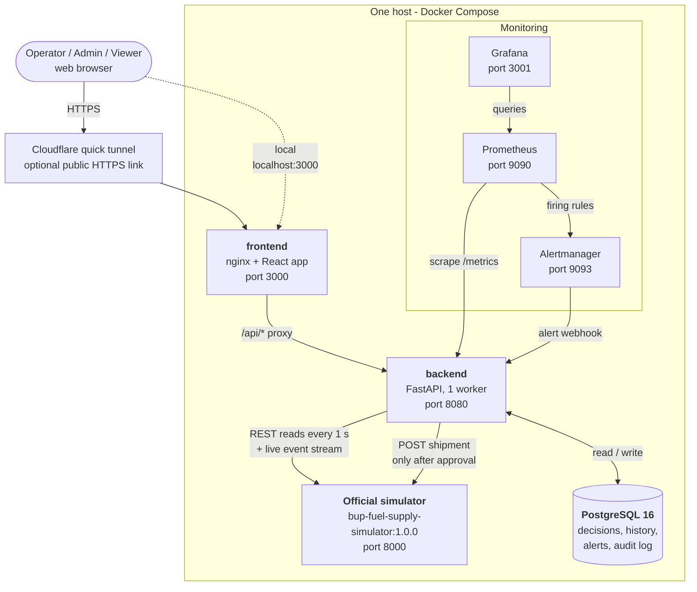
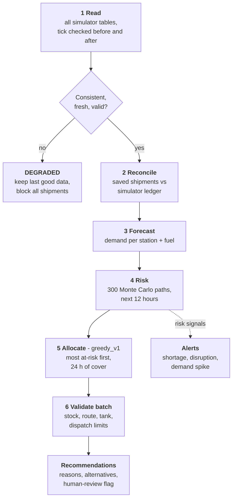
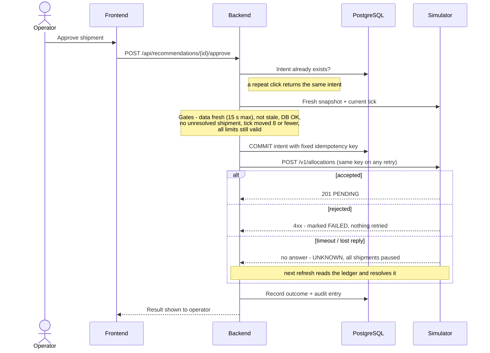
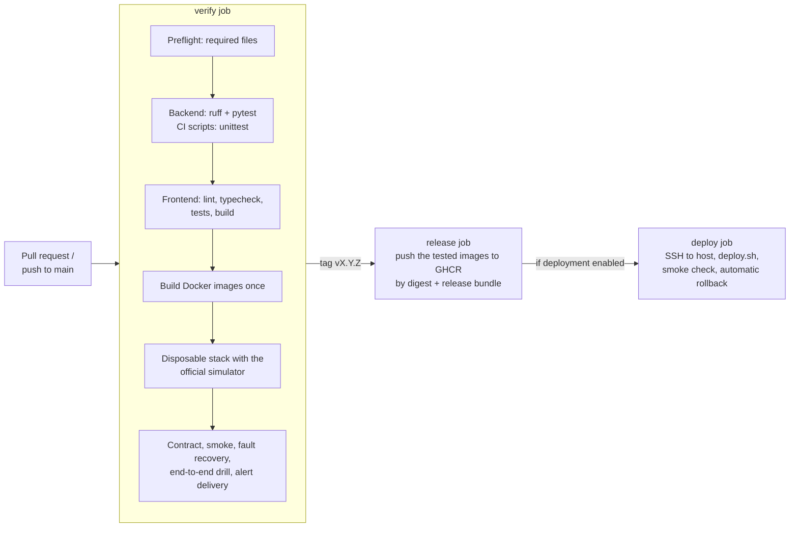

# Jalani: fuel supply control room

[](https://github.com/tayma-06/BUP_Hackathon_Final/actions/workflows/ci.yml)

Jalani is a control room for the BUP hackathon's fuel-supply simulator.

- **Sees** every depot, station, route, shipment and supply arrival, refreshed every second.
- **Predicts** demand and the risk that each station runs out of each fuel in the next 12 hours.
- **Recommends** shipments that respect every limit (depot stock, route capacity, tank space, dispatch budget). Each one comes with its reasons and alternatives.
- **Waits for a human.** An operator approves each shipment, and every decision is audited. A double click can never send two trucks.
- **Fails safe.** If the simulator or database breaks, Jalani keeps showing the last good data, blocks new shipments, and recovers on its own.
- **Watches itself.**
  - Raises a **forecast drift** alert when its predictions are consistently off.
  - Flags **unexplained inventory changes** that no sale or delivery accounts for.
  - Keeps every allocation-policy change as a **version you can roll back**.
  - Doesn't repeat a proposal an operator just **rejected**, unless the risk gets clearly worse.

Everything shown is a **simulated environment**. No real infrastructure is controlled.

---

## Architecture

### System overview

Everything runs on one machine with Docker Compose. The browser only talks to the frontend. The backend is the only component that talks to the simulator.



| Component | What it does |
|---|---|
| **frontend** | React operator console with 10 pages, served by nginx. It forwards `/api/*` to the backend, so the browser never talks to the simulator. |
| **backend** | Reads and validates the simulator, forecasts, scores risk, proposes shipments, enforces roles and safety gates, sends approved shipments, and exposes health and metrics. |
| **PostgreSQL** | Durable memory: shipment intents with idempotency keys, recommendations, demand history, snapshots, alerts, incidents and the audit log. Every table has a retention limit. |
| **simulator** | The organizers' official image, used unchanged. It is the only source of truth about the fuel world. |
| **Prometheus / Alertmanager / Grafana** | Metrics, alert rules and a 20-panel dashboard. Firing alerts are delivered back into the app, so operators see them on the Alerts page. |

### Inside the backend: one decision cycle

This runs about every second, and immediately when the simulator's event stream reports a change.



### Approving a shipment: the safety gates

Nothing reaches the simulator unless every gate passes. The shipment intent is **saved before it is sent**, so a crash or a lost reply can never create a duplicate.



### CI/CD pipeline



The full design, failure table and trade-offs are in [docs/architecture.md](docs/architecture.md). PNG versions of these four diagrams, for slides, are in [docs/diagrams/](docs/diagrams/).

---

## Quick start

You need Docker Desktop (or Docker Engine with Compose v2). Nothing else.

```bash
docker compose up -d --build --wait
```

Then open **http://localhost:3000**.

| Role | Username | Password | Can do |
|---|---|---|---|
| Operator | `operator` | `demo-operator` * | View everything, approve or reject shipments, acknowledge alerts |
| Admin | `admin` | `demo-admin` * | Everything, plus the **Control room** (run/pause/reset the simulator, inject events and faults, policy settings) |
| Viewer | `viewer` | `demo-viewer` * | Read-only |

\* These are the defaults. **If a `.env` file exists, its `*_PASSWORD` values win.** To set your own, run `cp .env.example .env` and edit it. Never commit `.env`.

The simulator starts **paused**. Sign in as admin → **Control room** → **Run**.

| Other services (local only) | URL |
|---|---|
| Backend health | http://localhost:8080/api/health |
| Simulator | http://localhost:8000/v1/health |
| Grafana dashboard | http://localhost:3001 (anonymous view; admin `admin` / `demo-grafana`) |
| Prometheus | http://localhost:9090 |
| Alertmanager | http://localhost:9093 |

To stop, run `docker compose down`, which keeps decision history. `docker compose down -v` deletes it.

> **Build fails with `certificate verify failed`?** Antivirus HTTPS scanning (for example Avast) or a proxy is intercepting TLS. Set `EXTRA_CA_FILE` in `.env`; see [docs/troubleshooting.md](docs/troubleshooting.md#starting-the-stack).

### Optional: a temporary public link

This shares the running app through a free Cloudflare quick tunnel. Only the app on port 3000 is exposed, not Grafana, Prometheus or the metrics endpoint.

```bash
docker run -d --name jalani-tunnel --network jalani_default \
  cloudflare/cloudflared:latest tunnel --no-autoupdate --protocol http2 --url http://frontend:80
docker logs jalani-tunnel 2>&1 | grep trycloudflare.com      # prints the https://... link
```

**Before sharing it, set strong passwords and a new `JWT_SECRET` in `.env`.** The link lasts only while this computer, Docker and the tunnel keep running, and a restart gives a new address. Give judges the operator or viewer login, not admin.

---

## The app: 10 pages

| Group | Page | Shows |
|---|---|---|
| Operations | **Overview** | Service level, unmet demand, fuel on the move, network map, top-5 stations at risk |
| | **Stations & depots** | Every tank: fuel, capacity, hours to stockout, incoming shipments |
| | **Recommendations** | Proposed shipments with risk before → after, the limits checked, alternatives; approve or reject |
| | **Alerts** | Shortages, disruptions, demand spikes and monitoring alerts; acknowledge |
| Intelligence | **Supply & disruptions** | Scheduled ship arrivals and active events |
| | **Forecasts** | Demand forecast with an uncertainty band, and projected fuel remaining |
| | **Decision history** | Every shipment with its operator, outcome and idempotency key; CSV export |
| Platform | **System health** | Each component's status, data age, latency; version and git SHA |
| | **Control room** (admin) | Run/pause/step/reset, inject events and faults, autopilot and policy settings |
| | **Audit log** | Who approved, rejected or changed what, and when |

---

## Results

Measured against the official simulator. Full method and limitations are in the linked reports.

**Policy benchmark** ([docs/benchmark.md](docs/benchmark.md)): 3 simulated days, same seed and the same events for every policy.

| Policy | Service level (baseline / stress) | Fuel moved (baseline / stress) |
|---|---|---|
| Do nothing | 30.7% / 26.5% | 0 / 0 |
| Naive "refill below 40%" | 100% / 100% | 297,971 L / 330,136 L |
| **Jalani greedy_v1** | **100% / 100%** | **269,033 L / 306,995 L** (7–10% less) |

**Load test** ([docs/load-test.md](docs/load-test.md)): 30 concurrent users refreshing every second. 0 failures, median 5.7 ms, p95 132 ms, backend at about 30% of one CPU core.

**Resilience** ([docs/validation-status.md](docs/validation-status.md)): simulator outage and stale data were detected in about 1 s. Cached data stayed readable, shipments were blocked, and the app recovered in about 1 s with no restart.

---

## Tests and verification

```bash
pip install -r backend/requirements-dev.lock
python -m ruff check backend
PYTHONPATH=backend python -m pytest backend/tests        # 73 backend tests
python -m unittest discover -s tests_ci                  # 22 CI/CD automation tests
cd frontend && npm ci && npm run lint && npm run typecheck && npm run test:ci && npm run build   # 17 tests
```

On Linux, macOS or WSL, `make test` runs all of these; `make help` lists every target.

> The `tests_ci` deployment tests create symlinks; on Windows they need Developer Mode, or run them in WSL.

The backend tests cover the nine required behaviors in [docs/ci-contract.md](docs/ci-contract.md):
- batch constraints
- concurrent approvals producing one shipment
- a lost reply reconciled after a restart
- changed-body rejection
- stale or old data blocking writes
- DB failure blocking writes
- changes propagating while the simulator is paused
- reset scoping
- human review and role checks

They also cover alert-webhook delivery, data retention, policy versioning and rollback, inventory reconciliation, forecast drift, and the rejection cooldown.

**Live checks** against a running stack. The ones marked ⚠ reset or disturb the simulator, so use them on a local or disposable stack only:

| Script | Proves |
|---|---|
| `scripts/app_smoke.py` | Frontend, login, health, fresh data, recommendations |
| ⚠ `scripts/simulator_contract.py` | The official simulator API behaves as documented (idempotent POST, cancel) |
| ⚠ `scripts/fault_probe.py` | Stale/outage detection, cached reads, readiness 503, recovery |
| ⚠ `scripts/e2e_drill.py` | Roles, over-limit rejection, double-approval → one shipment, delivery, disruption, demand spike |
| ⚠ `scripts/alert_delivery_probe.py` | Prometheus rule → Alertmanager → app → resolved |
| ⚠ `scripts/benchmark.py` | Policy comparison ([docs/benchmark.md](docs/benchmark.md)) |
| ⚠ `scripts/timed_rehearsal.py` | A timed run of the demo story |
| `loadtest/dashboard.js` (k6) | Dashboard latency under load ([docs/load-test.md](docs/load-test.md)) |

Saved results and screenshots are in [docs/evidence/](docs/evidence/).

---

## Project layout

```
backend/app/            FastAPI app
  main.py               API routes, roles, health, metrics, alert webhook, audit
  service.py            refresh loop, safety gates, approvals, reconciliation
  intelligence/engine.py  forecast, Monte Carlo risk, allocation, validation, alert detection
  sim/                  simulator client (retries, circuit breaker) and strict schemas
  db.py                 tables, retention, audit trail
backend/config/         demand profiles and allocation policy (YAML)
backend/tests/          behavioral tests + a fake simulator used only by tests
frontend/src/           React console (App.tsx, Charts.tsx) and tests (App.test.tsx)
docker/                 Dockerfiles and nginx config
docker-compose.yml      local / demo stack        compose.ci.yml   disposable CI stack
deploy/                 host compose file + env template used by the release pipeline
observability/          Prometheus rules, Alertmanager, Grafana dashboard + provisioning
scripts/                smoke, contract, faults, drill, alerts, benchmark, rehearsal, release, deploy, rollback
loadtest/               k6 scenario
.github/workflows/      CI -> release -> deploy
docs/                   architecture, demo script, troubleshooting, results, evidence
```

## Configuration

All settings are optional environment variables with demo defaults; see [.env.example](.env.example).

| Variable | Default | Meaning |
|---|---|---|
| `SIMULATOR_URL` | `http://simulator:8000` | Point at any simulator instance, including the judges' own |
| `SIMULATION_SPEED` | `1` | 1 ≈ 96 s per simulated day; the simulator's own default is 8 |
| `*_USER`, `*_PASSWORD` | `viewer` / `operator` / `admin`, `demo-*` | The three roles |
| `JWT_SECRET` | demo value | At least 32 characters; change it before sharing the app |
| `POSTGRES_PASSWORD` | demo value | Database password |
| `ALERT_WEBHOOK_TOKEN` | demo value | Shared secret between Alertmanager and the backend |
| `GRAFANA_ADMIN_PASSWORD` | `demo-grafana` | Grafana admin login |
| `CHAOS_ENABLED` | `false` | Demo-only crash / corrupt-response buttons |
| `ML_SERVICE_URL`, `LLM_API_KEY` | empty | Optional; empty means the local statistical forecast and template explanations |
| `EXTRA_CA_FILE` | none | Only needed behind TLS-scanning antivirus or proxies |

## Documentation

| Doc | Read it for |
|---|---|
| [docs/architecture.md](docs/architecture.md) | Full design: pipeline, safety gates, failure behavior, trade-offs |
| [docs/demo-script.md](docs/demo-script.md) | The 8-minute judge demo |
| [docs/troubleshooting.md](docs/troubleshooting.md) | When something doesn't work |
| [docs/benchmark.md](docs/benchmark.md) / [docs/load-test.md](docs/load-test.md) | Measured results |
| [docs/validation-status.md](docs/validation-status.md) | What has been verified, and what has not |
| [CI_CD_GUIDE.md](CI_CD_GUIDE.md) | CI/CD, release, deployment and rollback |
| [plan.md](plan.md) | Full product plan and constraints |

## Known limitations

- **Single host, single backend worker.** Short interruptions on restart; no high availability.
- **Risk and confidence are model estimates**, not calibrated probabilities. Forecast accuracy was not measured separately.
- **Supply is finite.** Long enough runs end in shortage whatever the policy does; Jalani then switches to rationing.
- **The public link is a temporary quick tunnel** on the presenter's machine, not a hosted deployment. The SSH deployment job in CI is ready but needs a server.
